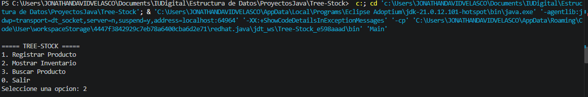
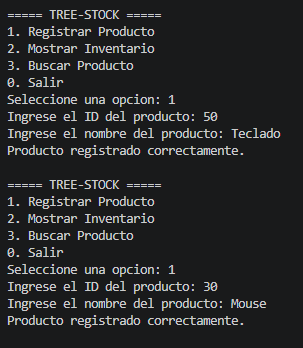
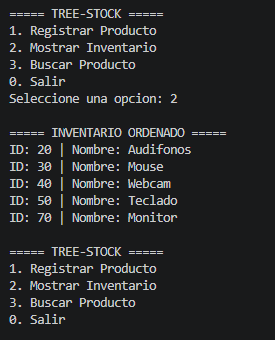
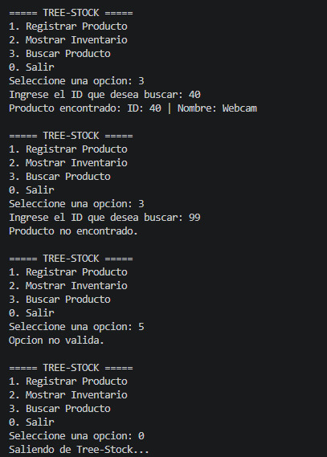

## Objetivo

Desarrollar una aplicación de consola en Java para gestionar un inventario mediante un árbol binario de búsqueda.

El sistema permite registrar productos utilizando su ID como criterio de organización, mostrar el inventario ordenado mediante un recorrido inorden y buscar productos por su ID.

## Tecnologías utilizadas

- Java
- Eclipse Temurin JDK
- Visual Studio Code
- Git
- GitHub

## Estructura del proyecto

El proyecto está dividido en tres clases:

- `Producto.java`: representa el nodo del árbol.
- `ArbolInventario.java`: contiene la lógica del árbol.
- `Main.java`: contiene el menú interactivo.

## Funcionamiento

Cada producto representa un nodo del árbol.

Los productos con un ID menor al nodo actual se ubican hacia la izquierda.

Los productos con un ID mayor al nodo actual se ubican hacia la derecha.

El recorrido inorden permite mostrar los productos ordenados de menor a mayor ID.

## Capturas de pantalla

### Menú principal



### Registro de productos



### Inventario ordenado



### Búsqueda de producto



## Link Video

https://drive.google.com/file/d/1KlTYSI18c5hBgk0Z_8GwVkwjEyP7T05X/view?usp=sharing

## Instrucciones de ejecución

1. Abrir el proyecto en Visual Studio Code.
2. Abrir una terminal.
3. Ubicarse en la carpeta del proyecto.
4. Compilar el proyecto:

```bash
javac *.java
